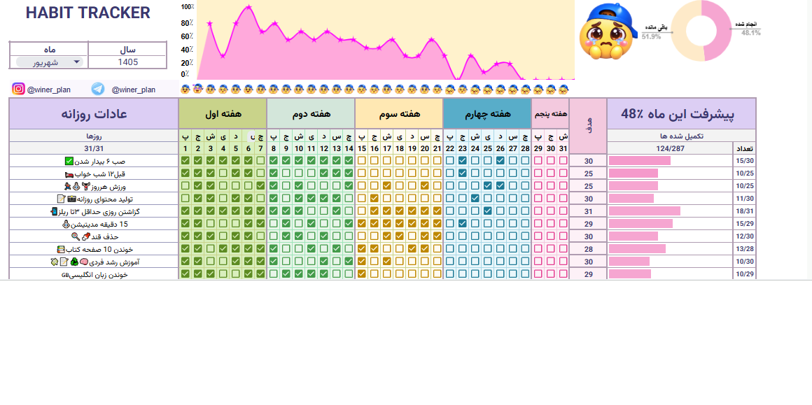

# Habit Tracker Google Sheets Template

A simple and visual Google Sheets habit tracker template

A customizable habit tracking system built in Google Sheets to help you monitor daily routines, build consistency, and visualize progress.

## Preview

## Features

✅ Daily habit tracking
✅ Automatic progress calculation
✅ Visual dashboard
✅ Weekly habit review
✅ Checkbox-based tracking
✅ Simple and customizable design

## How to Use

1. Open the Google Sheets template
2. Make a copy to your Google Drive
3. Customize your habits
4. Start tracking your progress

## What's Included

- Habit Tracker Dashboard
- Daily Tracking System
- Progress Visualization
- Weekly Review Section

## Demo

Coming soon...

## License

This project is a portfolio showcase.
